Lehrstuhl für Bioinformatik - Institut für Informatik - *http://www.bioinf.uni-freiburg.de*

---
## Bioinformatics 2
###### SS 2022
##### Exercise sheet 1: Hidden Markov models
---

### _Exercise 1 - Two kinds of dice_


A casino uses two kinds of dice: 98% of dice are fair and 2% are loaded. The loaded die has a probability of 0.5 to show number six and probability 0.1 for the numbers one to five.

**a)** When we pick up a die from a table at random, what is the probability of rolling a six?

<details>
  <summary>Formulae: (Spoiler)</summary>
<p align="center">
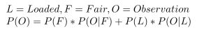
</p>
</details>

<details>
  <summary>Calculation Method: (Spoiler)</summary>
<p align="center">
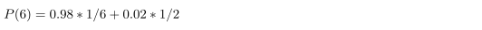
</p>
</details>

<details>
  <summary>Solution: (Spoiler)</summary>
<p align="center">
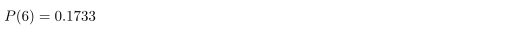
</p>
</details>

**b)** We pick up a die from a table at random and roll [&#9861; &#9861; &#9861;]. What is the probability, that the die is loaded?
<details>
  <summary>Formulae: (Spoiler)</summary>
<p align="center">
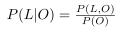
</p>
</details>

<details>
  <summary>Calculation Method: (Spoiler)</summary>
<p align="center">
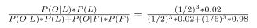
</p>
</details>

<details>
  <summary>Solution: (Spoiler)</summary>
<p align="center">
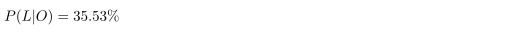
</p>
</details>

**c)** How many sixes in a row would we need to roll to be at least 90% sure that the die is loaded?
<details>
  <summary>Formulae: (Spoiler)</summary>
<p align="center">
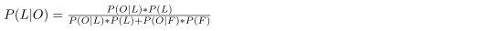
</p>
</details>

<details>
  <summary>Calculation Method: (Spoiler)</summary>
<p align="center">
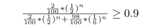
</p>
</details>

<details>
  <summary>Solution: (Spoiler)</summary>
<p align="center">
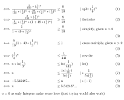
</p>
</details>

### _Exercise 2 - The occasionally cheating casino_
<p align="center">
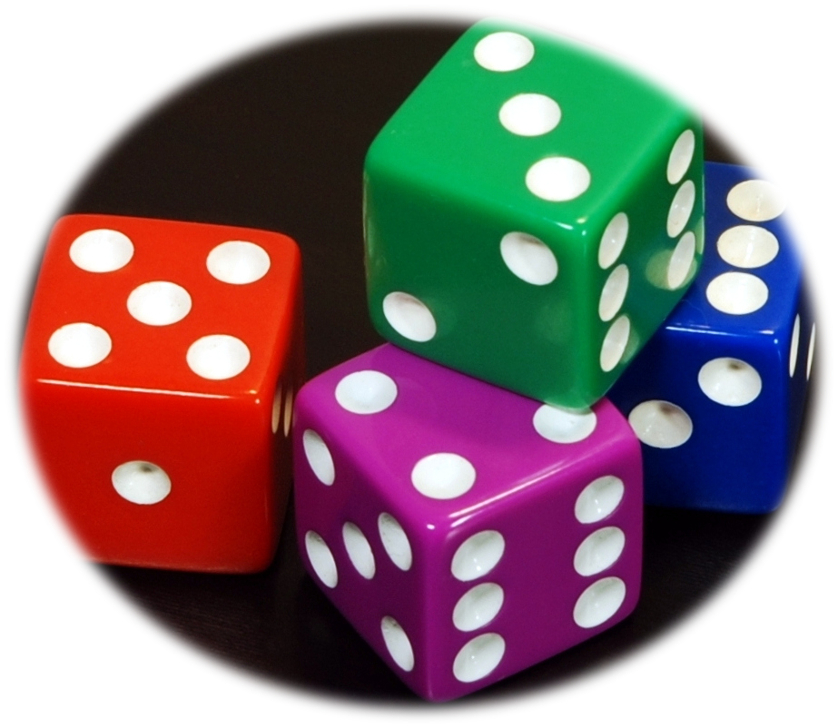
</p>

In a casino they use a fair die most of the time, but occasionally they switch to a loaded die. The loaded die has a probability 0.5 to show number six and probability 0.1 for the numbers one to five. Assume that the casino switches from a fair to a loaded die with probability 0.05 before each roll, and that the probability of switching back is 0.1. The probability to start a game with the fair die is 0.9.

**a)** Build the correct HMM graph. Match the letters from the blank figure to the numbers of the correct parts in the parts lists!

<p align="center">
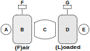
</p>

<details>
  <summary>Part List: A </summary>
<p align="center">
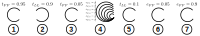
</p>
</details>

<details>
  <summary>Part List: B </summary>
<p align="center">
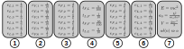
</p>
</details>

<details>
  <summary>Part List: C </summary>
<p align="center">
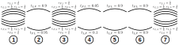
</p>
</details>

<details>
  <summary>Part List: D </summary>
<p align="center">
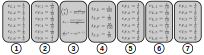
</p>
</details>

<details>
  <summary>Part List: E </summary>
<p align="center">
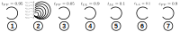
</p>
</details>

<details>
  <summary>Part List: F </summary>
<p align="center">

</p>
</details>

<details>
  <summary>Part List: G </summary>
<p align="center">
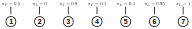
</p>
</details>

<details>
  <summary> Solution (Spoiler) </summary>
<p align="center">
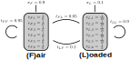
</p>
</details>

**b)** Given an observed sequence of outcomes O = 3661634 and two possible state sequences s<sub>1</sub> = LLLFFFF and s<sub>2</sub> = FFFFFFF (where F=fair and L=loaded), what are the joint probabilites P(O,p<sub>1</sub>) and P(O,p<sub>2</sub>) in the HMM described above?
<details>
  <summary>Formulae: (Spoiler)</summary>
<p align="center">
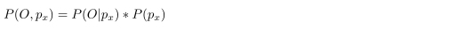
</p>
</details>

<details>
  <summary>Calculation Method: (Spoiler)</summary>
<p align="center">
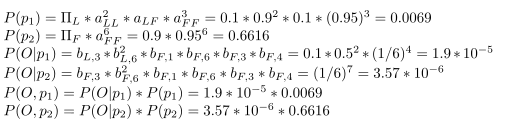
</p>
</details>

<details>
  <summary>Solution: (Spoiler)</summary>
<p align="center">
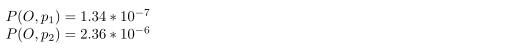
</p>
</details>

**c)** Give an observation O = 1662, how many possible state sequences exist in the described HMM?
<details>
  <summary>Calculation Method: (Spoiler)</summary>
The actual observation does not matter in this case because all emission probabilities are > 0.
Thus there are 2⁴ possible state sequences
</details>

<details>
  <summary> Solution (Spoiler) </summary>
16 possible state sequences
</details>


### _Exercise 3 - Programming Assignment_
In this exercise you will be working with dice: namely probabilities of different rolls, observations, state sequences etc.
In order to make your experience better we implemented a Die class for you.

You can create a die by simply providing the probabilities of the corresponding edges.
For example:
```
fair_die = Die(1/6, 1/6, 1/6, 1/6, 1/6, 1/6)
loaded_die = Die(0.1, 0.1, 0.1, 0.1, 0.1, 0.5)
```

You can access the value of the desired edge with two ways.

We prefer to start counting from zero so the probability of the first edge can be accessed by its index (which is 0) like:
```
fair_die[0]
```
Alternatively the value on the first edge is 1, so the edge probability can be accessed by the "name" of the edge and in this case we use the string value "1":
```
fair_die["1"]
```
We recommend sticking to the second way while solving the exercise.

Whenever we work with the set of dice we will define this set as a list of tuples. Each tuple consists a pair: a die and the corresponding probability of picking the die.
For example:
```
fair_die = Die(1/6, 1/6, 1/6, 1/6, 1/6, 1/6)
loaded_die = Die(0.1, 0.1, 0.1, 0.1, 0.1, 0.5)

casino_dice = [(fair_die, 0.98), (loaded_die, 0.02)]
```

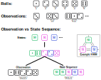

**a)** Implement the function `roll_proba_given_dice` which takes a `list of dice` and a `roll` value and returns the `probability of the roll`. A roll is a single value which can be obtained by throwing a die once.
                                                                        
<details>
  <summary>Example: (Spoiler)</summary> 
                                                                        
  ```
   >>> die = Die(1/6, 1/6, 1/6, 1/6, 1/6, 1/6)
   >>> roll_proba_given_dice(die, "6") 
  0.1666666666666667
  ```

</details>                                                                        

**b)** Implement the function `observation_given_die` which takes a `list of dice` and an `observation` and returns the `probability of the observation`.

**c)** Implement the function `proba_of_dice_given_observation` which takes a `list of dice` and an `observation` and returns the `probability for each die` to be used to have the corresponding outcome.

**d)** Implement the function `state_sequence_probability_computation` which takes a `list of dice`, a `state sequence` and the corresponding `transition matrix` for the given dice and returns the `probability of the state sequence`.

**e)** Implement the function `observation_probability_computation_given_state_sequence` which takes a `list of dice`, an `observation` and a `state sequence` and returns the `probability of the given observation`.

**f)** Implement the function `observation_state_sequence_joint_probability_computation` which takes a list of dice, an `observation` and a `state sequence` and return the joint probability of the observation and the state sequence.
